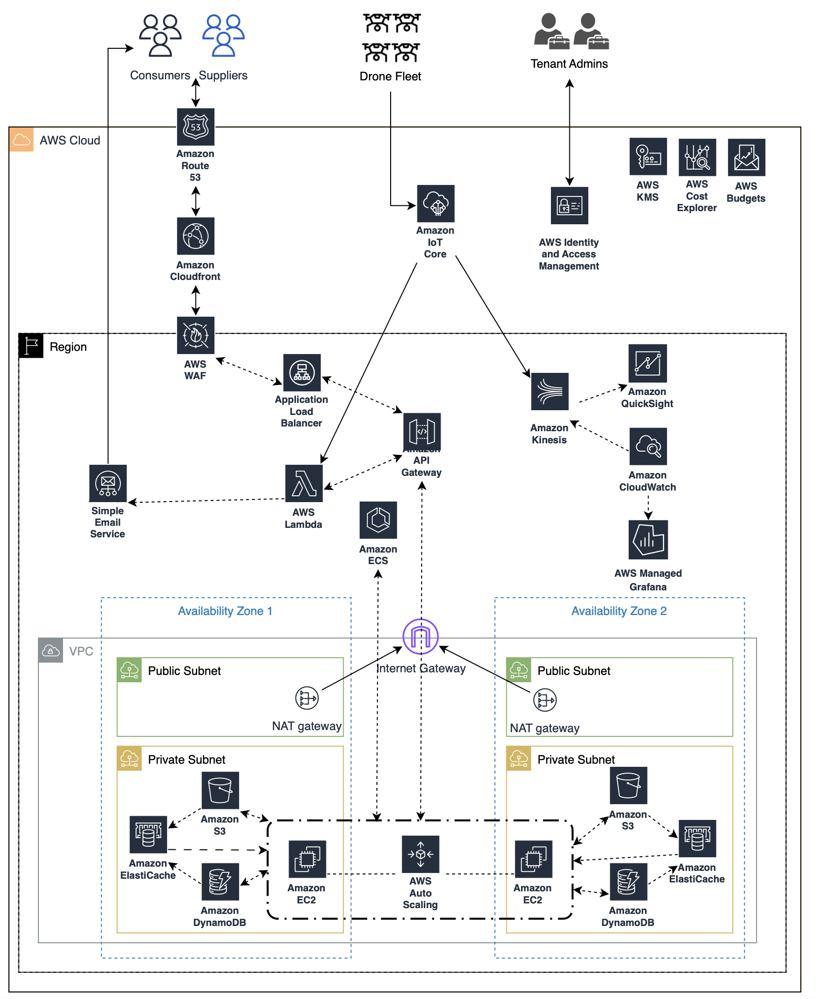
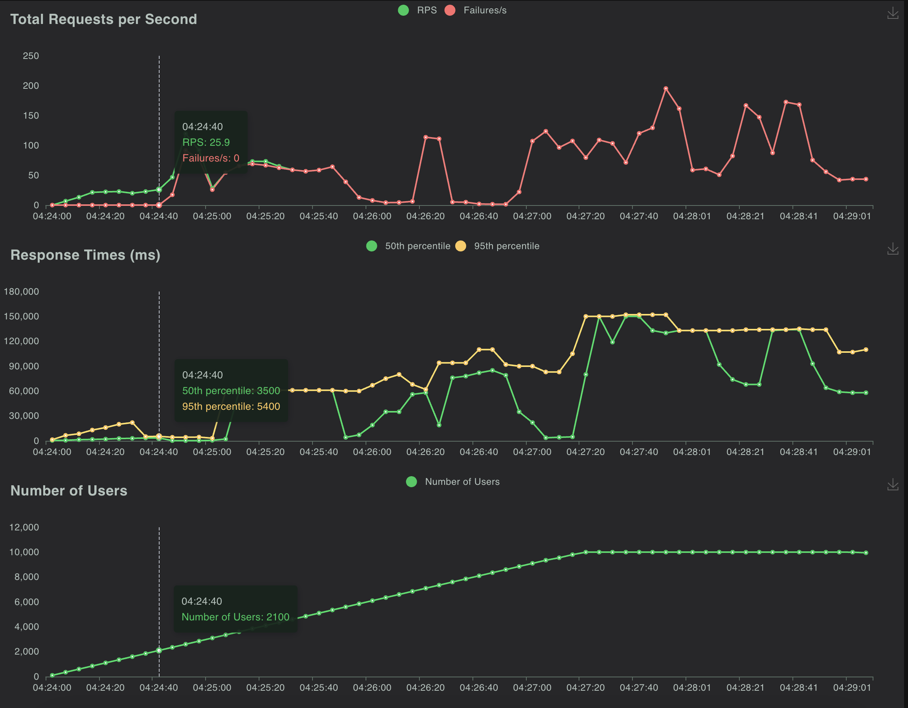
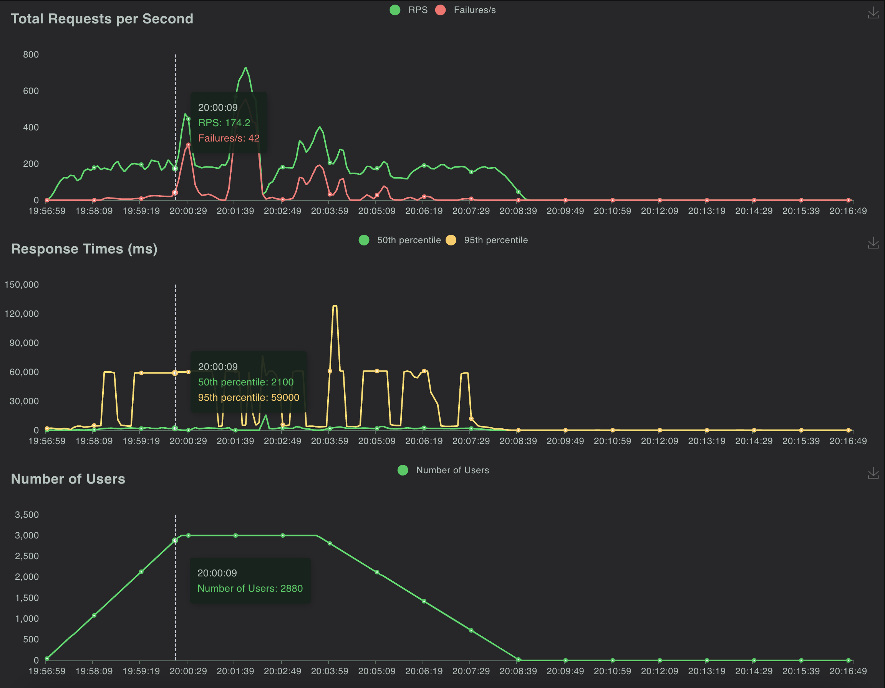

# Cloud Architecture Report

## Problem Statement
Traditional package shipping methods haven't been able to keep up with the increasing demands of efficiency, speed, and environmental responsibility in a world that is evolving rapidly. Present systems struggle to keep up with the demands of both businesses and customers since they tend to be inefficient and unsustainable. The challenge at hand involves bridging the gap by leveraging drone delivery; and cloud computing can offer a bunch of advantages to revolutionize the package delivery sector. The central objective of this project is to provide an innovative and scalable solution that optimizes logistics efficiency while enabling prompt, safe, and customer-focused delivery services.

## Requirements

#### Optimize costs
Reduce operational expenditures by utilizing cloud technology and optimizing resource distribution
to handle fluctuating workloads.

#### Tenant Identification
A robust tenant identification system is essential to ensure the segregation of data and resources,
granting access to authorized users within a diverse user base comprising of end consumers, e-commerce sites, operation executives, etc.

#### Real-time Monitoring and Control
Develop a real-time monitoring and control system to manage drone operations and ensure prompt
interventions when required.

#### Customer Engagement
Provide real-time parcel tracking and timely client alerts to enhance the delivery experience.

#### Performance Measurement
Utilize cloud-based analytics to continuously measure and improve performance based on key
metrics such as delivery times and customer satisfaction.

#### Data Security
Ensure the security and privacy of customer and operational data throughout the system.

#### Continuous Service Improvement
Establish a framework for continuous enhancement based on performance analytics and feedback.

#### High Availability
Ensure that the system is available at all times i.e. 24/7.

#### Delayed Data Collection
Some drones may not be connected to the internet at all times, yet all the data need to be synced
to the cloud as and when the network connectivity is established.

## Architecture 

## Kubernetes Experimentation

This experiment was done by leveraging the above mentioned components and tools. The objective of this experiment is to assess the scalability and performance of an application hosted on Amazon EKS using Kubernetes by simulating varying levels of user load with Locust.

In this experiment, the services use a virtual IP address that acts as a single entry point to a group of pods providing the same service. When traffic reaches this service, it is then distributed to individual pods based on the selected load balancing strategy. In our case, we selected an IP-based round robin load balancing technique, where each new connection request is directed to the next available pod IP address in a cyclical manner. Kubernetes utilizes a distributed system approach for load balancing. The control plane components like the node server, scheduler, and controllers are distributed across nodes in the cluster. Additionally, load balancing occurs across multiple pods, which are distributed across different nodes in the cluster, enhancing scalability and fault tolerance.

We created a cluster with the default configurations as offered by AWS EKS. Once the cluster was active, we create a managed node group with initial count of 2 nodes, minimum of 2 and a maximum of 5 nodes. The instance types we chose were $t3.micro$ and $t3.medium$. So far as the pods are concerned, we started with conservative resource requests and limits for our pods, with CPU request as 0.2 and memory limit of 200Mi. We used the public docker image available for NextCloud and deployed the same on our cluster.

## Results

### Without Auto Scaling

### With Auto Scaling

## Conclusion

This cloud architecture project was a complex and challenging endeavor that required careful planning, critical decision-making, and continuous iteration. The project began by clearly defining the problem that needed
to be solved, taking into account both business and technical requirements. Choosing a cloud provider was
a critical decision that had a significant impact on the project’s success. The provider was selected based on
a set of predefined criteria and a detailed comparison of different options. The chosen provider not only met
the project’s requirements but also offered a suite of services that were essential for the project’s success.
The project’s design evolved over time, from a simple initial design to a complex and detailed blueprint.
The design was based on the AWS Well-Architected Framework and incorporated best practices for scalability, security, and reliability. We also experimented with Kubernetes to validate the scalability an application.
These experiments proved how autoscaling (pod and node combined) could handle varying loads effectively,
which is important for real-world implementation.
In conclusion, this project was a valuable learning experience that taught us a lot about designing cloud
architectures. We understood the importance of using structured methodologies, validating designs thoroughly, and considering trade-offs carefully.
